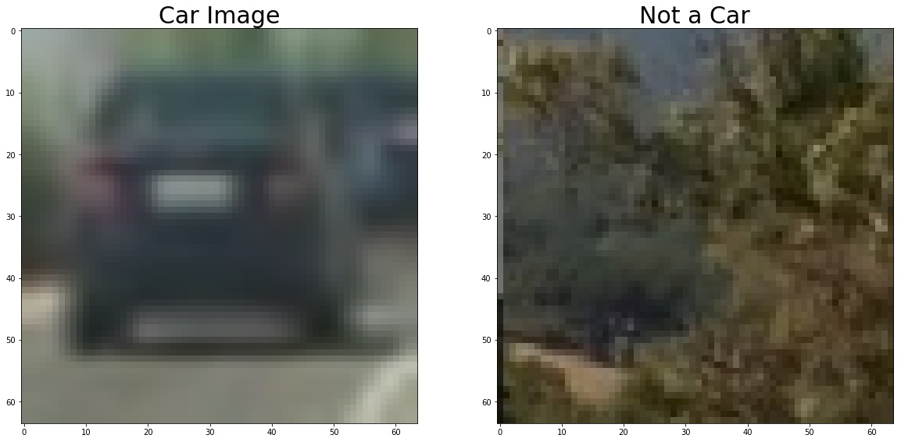
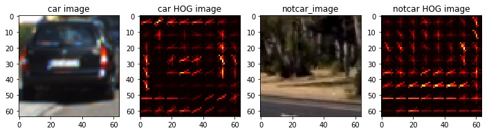
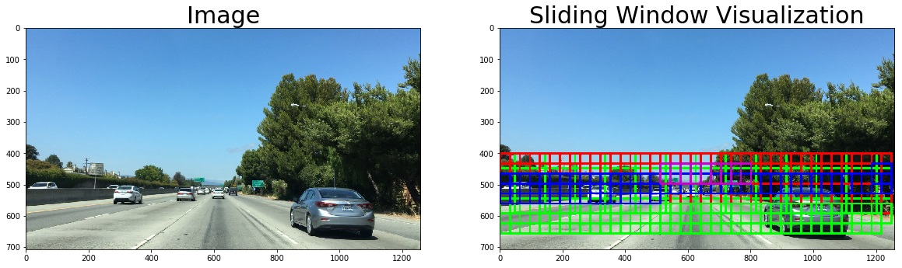
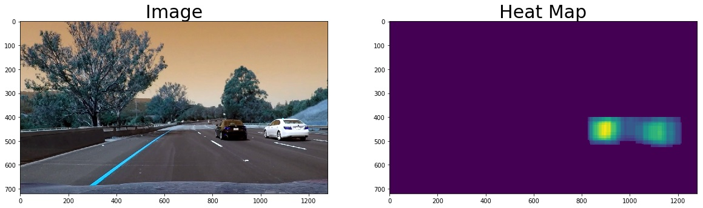
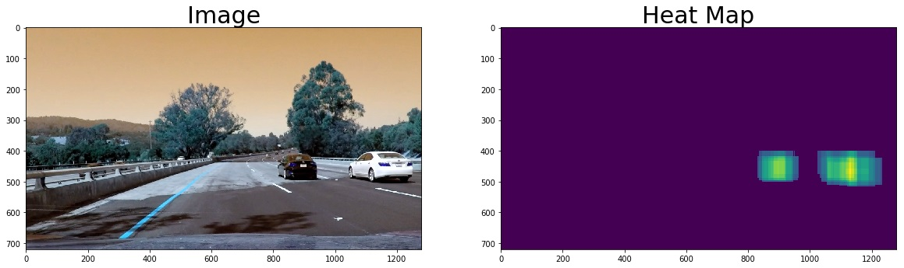
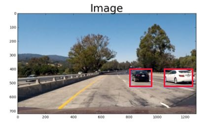

# CarND-ObjectDetection
**Vehicle Detection Project**

The goals / steps of this project are the following:

* Perform a Histogram of Oriented Gradients (HOG) feature extraction on a labeled training set of images and train a classifier Linear SVM classifier
* Optionally, you can also apply a color transform and append binned color features, as well as histograms of color, to your HOG feature vector. 
* Note: for those first two steps don't forget to normalize your features and randomize a selection for training and testing.
* Implement a sliding-window technique and use your trained classifier to search for vehicles in images.
* Run your pipeline on a video stream (start with the test_video.mp4 and later implement on full project_video.mp4) and create a heat map of recurring detections frame by frame to reject outliers and follow detected vehicles.
* Estimate a bounding box for vehicles detected.

Below steps are performed to achieve vehicle detection and tracking in a video stream .

+ **Feature Extraction** - apply five techniques, including histograms of color, color distribution, spatial binning, gradient magnitude, and Histogram of Oriented Gradients (HOG), on the labeled training set of images to create a feature vector.
+ **Preprocessing Data** - normalize, randomize, and split the labeled data into a training set, a validation set, and a testing set.
+ **Training** -  train a Linear SVM classifier on the labeled training set
+ **Sliding Windows** - implement a technique to search an image for vehicles using the trained classifier, and optimize the algorithm's efficiency by limiting the search area of the image and/or using heat maps that reject outliers of the positive windows.
+ **Video** - run a function using moviepy that estimates a bounding box for detected vehicles frame by frame.

### Feature Extraction

Several different techniques for feature extraction were used this project, including histograms of color, color distribution, spatial binning and Histogram of Oriented Gradients (HOG). Each has its own effect on the feature vector that is produced, and when combined the techniques tend to improve the chosen classifier's performance.

I started by reading in all the vehicle and non-vehicle images. Here is an example of one of each of the vehicle and non-vehicle classes:

### Histogram of Oriented Gradients (HOG)
The code for extracting HOG features from an image is defined by the method get_hog_features and is contained in the cell titled "Define Method to Convert Image to Histogram of Oriented Gradients (HOG)." The figure below shows a comparison of a car image and its associated histogram of oriented gradients, as well as the same for a non-car image.
The scikit-image package has a built in function to handle HOG extraction, which is tuned by parameters including orientations, pixels_per_cell, and cells_per_block. 

**orientations:** I tried with both 8 and 9 , later find there is no such huge difference , so kept it with 9 .
pixels_per_cell and cells_per_block : I kept these values  unchanged what I tried earlier in scikit-image HOG tutorial .This gave a good result .

There is a balance to be struck between accuracy and speed of the classifier, and my strategy was to bias toward speed first, and achieve as close to real-time predictions as possible, and then pursue accuracy if the detection pipeline were not to perform satisfactorily.

### Preprocessing Data

The training data was normalized, randomized, and splitted into training and testing sets, with 20% of the data segregated for the testing set.

### Training the SVC Classifier

After exploring feature extraction techniques, I trained a SVC classifier to classify the dataset as "vehicle" or "not-vehicle".  The accuracy for this classifier was above 94% for multiple iterations . 

It took 71.3072395324707 Seconds to compute features...
Using: 9 orientations, 8 pixels per cell, 2 cells per block, 32 histogram bins, and (32, 32) spatial sampling
Feature vector length: 8460
8.25 Seconds to train SVC...
Test Accuracy of SVC was 0.9916

### Sliding Windows Search

Object Detection.ipynb outlines the sliding windows approach to search for vehicles in a test image with trained SVC classifier.

In the section titled "Method for Using Classifier to Detect Cars in an Image" I adapted the method find_cars from the lesson materials. The method combines HOG feature extraction with a sliding window search, but rather than perform feature extraction on each window individually which can be time consuming, the HOG features are extracted for the entire image (or a selected portion of it) and then these full-image features are subsampled according to the size of the window and then fed to the classifier. The method performs the classifier prediction on the HOG features for each window region and returns a list of rectangle objects corresponding to the windows that generated a positive ("car") prediction.

### Video
 The video of my project can be found in the repo with the file name 'project_video_output.mp4'
 
 The working of the video precessing pipeline is as follows:
 Firstly we load the saved data from the SVC training. 
 Then we define the range or roi where to search for the cars.
 Then we use the find_cars function to find the heatmaps and iterate over different scales.
 Then sum togehter the last 5 frame heatmaps into 1 heatmap and use threshold to help remove false positives from heatmap.
 We then obtain the box positions from heatmap, store box parameters for each box as a new capture , sync old captures with new captures
 and finally draw bounding boxes on a copy of the image.
 
 An example for heatmaps generated:
 
 The sync method is described in the Object detection.pynb
 
 
 
 
 
### Discussion

Getting the right combination of parameters to make the code work on the video pipeline was a bit challenging .Feature extraction played a major role and combining results of different feature extractors  was  a good learning point .I observed HOG and spatial binning are very crucial for this project . 

Two more things are the sliding window  technique and  removing false positives from the video frames also very important .

My future course of action would be to implement the same with deep learning object detection and recognition techniques , which is more robust .

It's a new learning experience all together with different types of features from the images .

Thank you !

